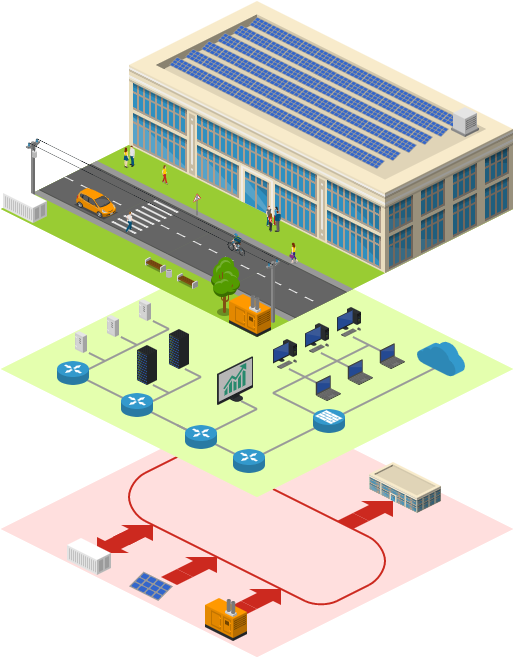
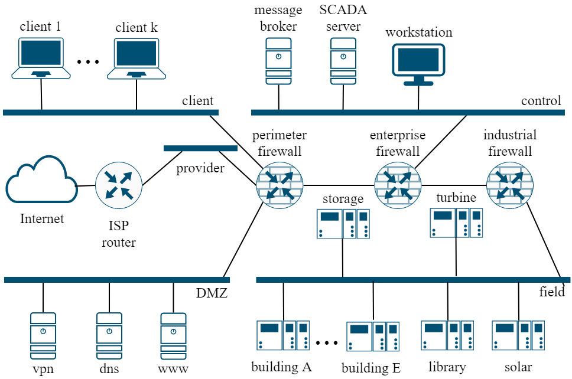
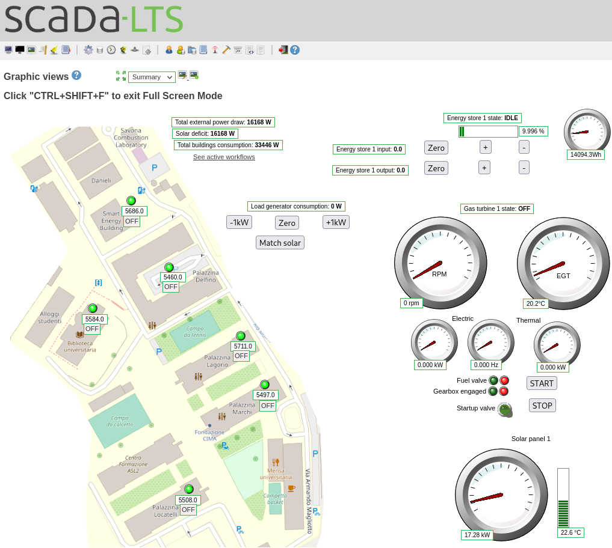

# The LiDiTE framework

This framework allows the realization of Digital Twins.
Here it is configured for implementing the use case of the Savona Polygeneration Microgrid (SPM) expressed in the paper _LiDiTE: a Full-Fledged and Featherweight DigitalTwin Framework_.







## Quickstart

```sh
make build
make up
```

### Prerequisites

- Docker engine
- Docker compose
- GNU Make

## Components of the repository

This repository is comprised of multiple components, some of which belong to the framework and some of which belong to the SPM use case.

In this root directory multiple module YAML files are defined, which can be added to the environment by modifying the `modules` variable inside of the [Makefile](./Makefile).

These modules combine and configure the framework-provided or their own container images to implement the SPM use case, storing the configuration files inside of the [config directory](./config/README.md).

### Modules belonging to the framework

- [DNS Server](./chassis-bind9.yml) implemented via [BIND9](./bind9/README.md)
- An Eclipse Ditto instance (authenticated via [a reverse proxy](./ditto-nginx/README.md)) which is either:
  - [The upstream Eclipse Ditto implementation](./chassis-ditto-full.yml)
  - [Our own lightweight Eclipse Ditto repackaging](./chassis-ditto-small.yml) via a [custom container image](./ditto-binpack/README.md)
- [Eclipse Ditto database server](./chassis-ditto-database.yml)
- [Eclipse Ditto custom provisioner](./chassis-ditto-register.yml) using our [custom container image](./ditto-register/README.md)
- [Docker API proxy](./chassis-docker-api-proxy.yml)
- A multi-tier network implemented with:
  - The [Dovesnap Docker network plugin](./dovesnap/README.md)
  - Multiple [networks](./net-ovs.yml)
  - Multiple [routers](./chassis-routers.yml) implemented via [OpenWRT](./openwrt/README.md)
  - A [VPN](./chassis-vpn.yml) for external access leveraging [OpenVPN](./vpn/README.md)
- [SCADA server](./chassis-scada.yml) using the [ScadaLTS project](./camunda-scada-lts/README.md)
- [Workflow automation platform](./chassis-scada.yml) using the [Camunda workflow automation platform](./camunda-scada-lts/README.md), configured automatically via our [custom provisioner](./camunda-scada-lts-deployer/README.md), managing scheduled tasks via our [custom scheduler](./camunda-scada-lts-cron/README.md)
- [Workflow visualizer](./chassis-workflows-viewer.yml) implemented via a [custom web application](./camunda-scada-lts-workflow-viewer/README.md)
- [Performance sampling environment](./performance-sample.yml) for gathering metrics on the framework resource usage
- [Test services](./test_services.yml) for inspecting the network endpoints
- PLC execution environment using [OpenPLC](./openplc/README.md)
- Virtual machines execution environment using [QEMU KVM](./kvm-docker/README.md)
- [Dummy containers](./nothing/README.md) for simulating network devices
- A [simulator](./scriptablesensor/README.md) for physical devices

### Modules belonging to the SPM use case implementation

- ModBus managed power cabinets with associated controller PLCs for six buildings [1](./savona-cabinet-biblioteca.yml),[2](./savona-cabinet-delfino.yml),[3](./savona-cabinet-lagorio.yml),[4](./savona-cabinet-locatelli.yml),[5](./savona-cabinet-marchi.yml),[6](./savona-cabinet-seb.yml)
- [Use case specific settings](./savona-ditto-customization.yml) for the framework-provided Ditto instance
- An [operator workstation](./savona-operator.yml) running Windows
- [Use case specific settings](./savona-scada-customization.yml) for the framework-provided SCADA server and workflow automation software
- Physical components of the SPM implemented [via the simulator](./savona-sensors.yml) including:
  - [Energy storage](./config/scriptablesensor/energy-store-1/README.md)
  - [Gas turbine](./config/scriptablesensor/gas-generator-1/README.md)
  - [Solar panel](./config/scriptablesensor/solar-panel-1/README.md)
- Environmental factors of the SPM implemented [via the simulator](./savona-sensors.yml) including:
  - [Building occupancy](./config/scriptablesensor/people-simulator/README.md)
  - [Solar radiance](./config/scriptablesensor/sun-simulator/README.md)
- [A proxy for the real website](./savona-website.yml) implemented via [NGINX](./config/nginx/nginx.conf)
- [Use case specific settings](./savona-workflows-viewer-customation.yml) for the framework-provided workflow visualizer software
